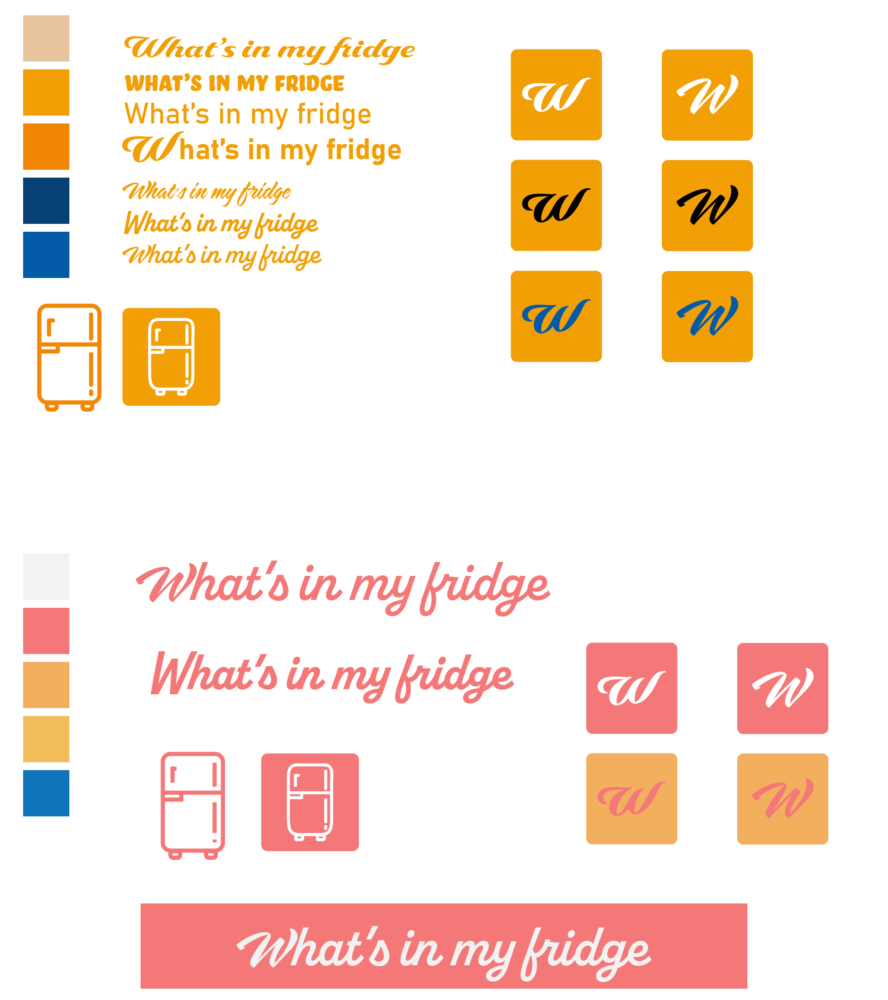

# **What's In my fridge**

## Contents
- [Concepts](#Concepts)
- [Visiteur public](#Visiteur-public)
- [Design](#Design)
- [Technology Use](#Technology-Use)
- [Database](##Database)
- [Initialisation du Dossier](#Initialisation du Dossier)

## Concepts
An association of small traders proposes simple and fast recipes to make with the ingredients of its fridge, this site will evolve towards a possibility of ordering the basic products necessary to constitute simple and fast recipes near its tradesmen of proximity

## Visiteur public
Anyone who is lazy about cooking from the student who doesn't know what to eat quickly but healthily, the busy worker or the overworked parent who is short of inspiration

## Design
First design proposal:

## Technology Use

### FrontEnd:

- We have chosen to use the Bootstrap 5 library to meet the criteria of Responsive design

### Back-End:

- We have chosen to use the Symfony Framework to meet the MVC criteria

##Database:
First database proposal

#Initialisation du Dossier
``symfony new --webapp whatsInMyFridge``

1. Pour recupere le dossier :
>`git clone [lien du repository]`  
>`composer install`
